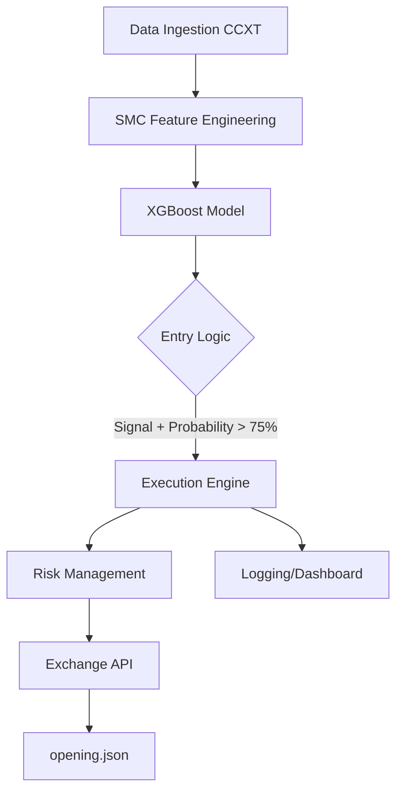

# Technical Architecture: SMC Crypto AI Trading Bot

## System Overview
The bot utilizes Smart Money Concepts (SMC) combined with an XGBoost classifier to trade BTC, XRP, and SOL on the 15m timeframe, using 1h for bias.

## Component Diagram

## Data Engineering
- **Symbols**: BTC/USDT, XRP/USDT, SOL/USDT
- **Timeframes**: 15m (Execution), 1h (Bias)
- **Features**: 
    - BOS (Break of Structure)
    - CHoCH (Change of Character)
    - Order Blocks (OB) - Price levels of significant institutional buying/selling
    - Fair Value Gaps (FVG) - Imbalances in price delivery
    - Liquidity (Equal Highs/Lows)

## Machine Learning (XGBoost)
- **Target**: Binary classification (1: Hit 3:1 TP, 0: Hit SL first)
- **Input**: SMC features, volume, time of day (London/NY Kill Zones)
- **Validation**: Walk-forward cross-validation

## Execution & Risk Management
- **Initial Margin**: $1000
- **Risk per Trade**: 1% of account equity
- **Stop Loss**: Swing high/low of the OB
- **Take Profit**: 3:1 RR
- **Constraints**: 
    - No trading during CPI/FOMC
    - Max 2 concurrent trades
    - 3% Daily Drawdown Kill-switch

## Project Structure
- `main.py`: Entry point for the bot
- `src/data_fetcher.py`: CCXT integration for OHLCV
- `src/smc_analysis.py`: Logic for calculating SMC features
- `src/ml_model.py`: XGBoost training and prediction
- `src/executor.py`: Trade execution and risk management
- `opening.json`: Persistence for open positions
- `logs/`: Directory for decision logging
